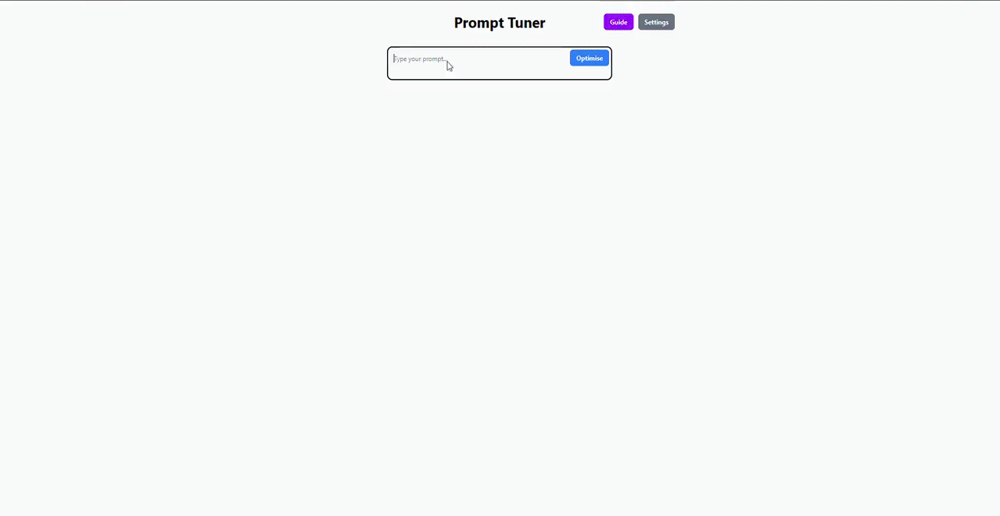

# Prompt Tuner

**Prompt Tuner** is a React + Tailwind web app designed to optimise prompts for AI models like OpenAI's GPT. It helps users rewrite their prompts for clarity, precision, and usefulness, provides a quality score, allows running the optimised prompt to get AI responses, and lets users **export their prompt history**. Ideal for anyone working with AI and prompt engineering.  

---

## Features

- Rewrite prompts for clarity, precision, and effectiveness  
- Scores prompts (1–10) based on clarity, precision, and usefulness  
- Run optimised prompts with OpenAI API  
- Keeps a **history of prompts and responses**  
- **Export prompt history** to a file for backup or analysis  
- Settings modal for managing API keys
- API key error handling (alerts users if the key is missing or invalid)
- Responsive, modern UI with TailwindCSS  

---

## Demo

- **Test 1:** A vague prompt with incorrect grammar
- **Test 2:** A technical prompt
- **Prompt History Export:** See the `demo` folder  
  

---

## Tech Stack

- **Frontend:** React (Vite)  
- **Styling:** TailwindCSS  
- **API:** OpenAI GPT  
- **State & Persistence:** React state + localStorage  

---

## Prerequisites

Make sure you have the following installed on your machine:  

- [Node.js](https://nodejs.org/) v20 or higher  
- npm (comes with Node.js)  
- OpenAI API key (free or paid account)  

---

## Running the Project Locally

```bash
# 1. Clone the repository
git clone https://github.com/Paraparan1/prompt-tuner.git
cd prompt-tuner

# 2. Install dependencies
npm install

# 3. Run the development server
npm run dev
